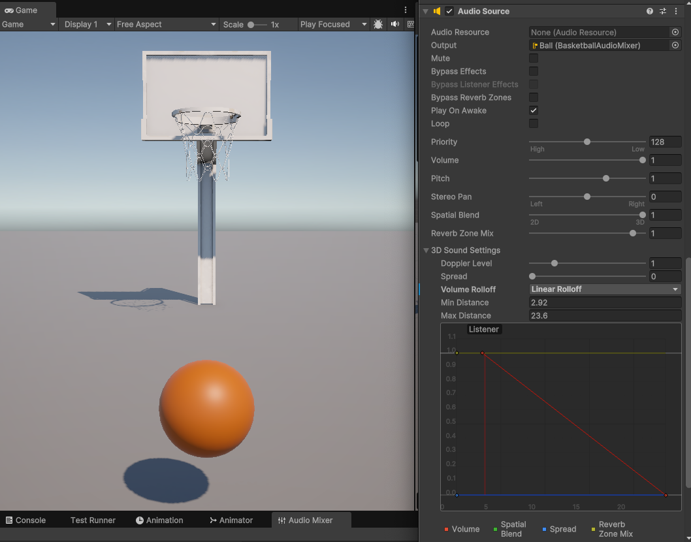

# Unity-Physics-Sound

A sample Unity (60000.0.26f1) project that shows...

## BasketballShooter

- Moving object (a basketball) using the Physics system and [AddForce()](https://docs.unity3d.com/6000.0/Documentation/ScriptReference/Rigidbody.AddForce.html)
- Playing [diegetic](https://www.youtube.com/watch?v=2vlwm4VyyTc) sound effects with AudioSource
- [Transition](https://www.youtube.com/watch?v=2nYyws0qJOM) between sounds using AudioMixer and Snapshots
