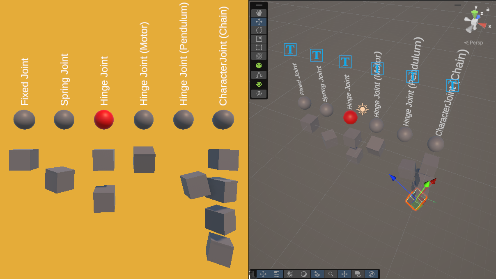

# Unity-Physics-Sound

A sample Unity (60000.0.26f1) project that shows...

## BasketballShooter

- Moving object (a basketball) using the Physics system and [AddForce()](https://docs.unity3d.com/6000.0/Documentation/ScriptReference/Rigidbody.AddForce.html)
- Playing [diegetic](https://www.youtube.com/watch?v=2vlwm4VyyTc) sound effects with AudioSource
- [Transition](https://www.youtube.com/watch?v=2nYyws0qJOM) between sounds using AudioMixer and Snapshots

## JointExamples

- Several physics joints including [Fixed](https://docs.unity3d.com/Manual/class-FixedJoint.html), [Spring](https://docs.unity3d.com/Manual/class-SpringJoint.html), [Hinge](https://docs.unity3d.com/Manual/class-HingeJoint.html), and [Character](https://docs.unity3d.com/Manual/class-CharacterJoint.html). See this [video](https://www.youtube.com/watch?v=MElbAwhMvTc&t=1s) for more.
- `OnValidate()` to save references on compilation

